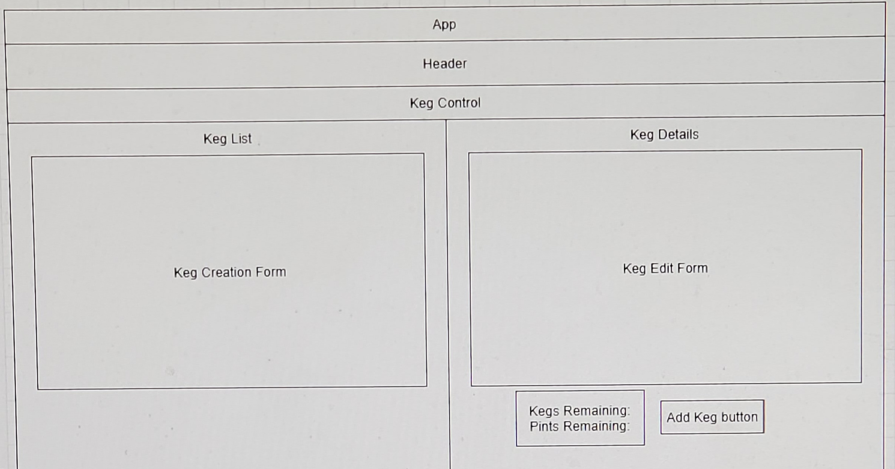

# _Keg-Tap_

### By _**Zack Rutledge**_

[Epicodus](https://www.epicodus.com/) - [React](https://www.learnhowtoprogram.com/ruby-and-rails/) - [Week 2](https://www.learnhowtoprogram.com/react/react-fundamentals/help-queue-merch-site-event-logger-two-day-project)

#### Date created: 04/21/2021
---

## Technologies Used

* _React 3.2.0_
* _JavaScript_
* _Bootstrap_
* _MDBReact_
* _Webpack 4.41.0_
* _git 2.30.0_

---

## Description

---

## User Stories

As a user, I want to see a list/menu of all available kegs. For each keg, I want to see its name, brand, price and alcoholContent (or perhaps something like flavor for a kombucha store).
As a user, I want to submit a form to add a new keg to a list.
As a user, I want to be able to click on a keg to see its detail page.
As a user, I want to see how many pints are left in a keg. Hint: A full keg has roughly 124 pints.
As a user, I want to be able to click a button next to a keg whenever I sell a pint of it. This should decrease the number of pints left by 1. Pints should not be able to go below 0.

---

## Component Diagram

---

## Setup/Installation

* You will need to use your system's **terminal emulator** to setup and locally use this application.
* This project uses npm as a package manager, you can download it [here](https://www.npmjs.com/get-npm).
* To clone this directory, navigate in your terminal to the desired location of the project and run command `git clone https://github.com/dethik/keg-tap.git`
* Navigate to top level of the directory with command `cd keg-tap`
* To install dependencies into the project run command `npm install`
* To launch this project in a browser, run command `npm run start`
* To exit live server, press Ctrl+C in your terminal

---

## Editing Instructions

* To use Visual Studio Code to edit this project, follow install instructions [here](https://code.visualstudio.com/).
* To enable command `code`, open VS Code, click on View > Command Palette, type in "shell command", and click on "Shell Command: Install 'code' command in PATH"
* Now, from your terminal, in the project's top level directory, you can run command `code .` to open project in VS Code.

---

## License

> [GPLv3](https://choosealicense.com/licenses/gpl-3.0/)\
> Zack Rutledge &copy; 2021

---

## Contact Information

* _Contact Zack via [Email](mailto:thorgrim88@gmail.com) or [LinkedIn](https://www.linkedin.com/in/zack-rutledge762/), or check out his [Github](https://github.com/dethik)._